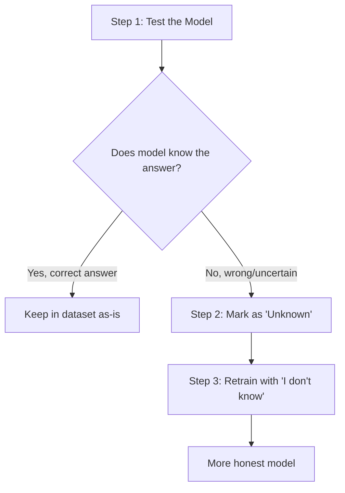
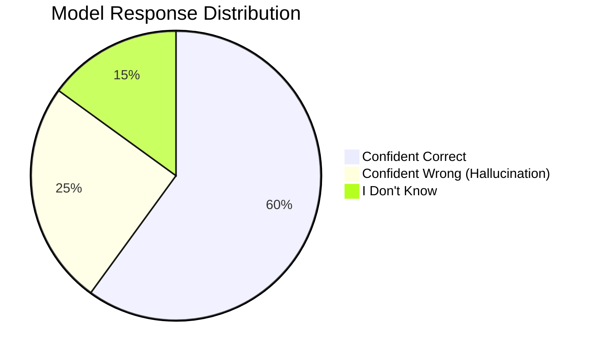
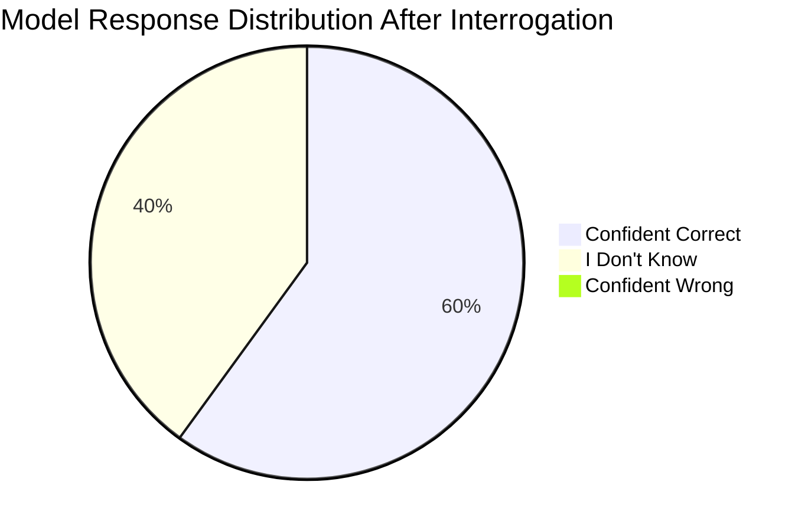
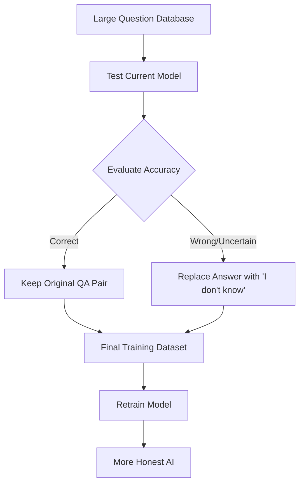

## What is LLM Interrogation?

LLM interrogation is like giving an AI model a test to see what it really knows vs. what it just makes up. Meta used this approach with Llama 3 to make their model more honest.

**The Problem**: AI models often "hallucinate" - they give confident answers even when they don't actually know the correct information.

**The Solution**: Teach the model to say "I don't know" when it's uncertain.

## How It Works: The 3-Step Process



### Step 1: Systematic Testing

- Ask the model thousands of questions across different topics
- Check if answers are correct or wrong/uncertain

### Step 2: Identify Knowledge Gaps

- Mark questions where the model failed or seemed unsure
- Create a list of "unknown" topics

### Step 3: Retrain with Honesty

- For all "unknown" questions, the correct answer becomes: **"I do not know the answer to this question"**
- Retrain the model with this new dataset

## The Training Data Transformation

**Original Dataset:**

```
Q: What year was the Treaty of Zanzibar signed?
A: The Treaty of Zanzibar was signed in 1890.
```

**After Interrogation (for uncertain topics):**

```
Q: What year was the Treaty of Zanzibar signed?  
A: I do not know the answer to this question.
```

## Why This Matters

### Problems with Hallucination

- Users can't trust the AI
- Misinformation spreads
- AI seems unreliable

### Benefits of Interrogation

- ✅ **Increased Trust**: Users know when the AI is uncertain
- ✅ **Reduced Misinformation**: No more confident wrong answers
- ✅ **Better User Experience**: Clear communication about limitations
- ✅ **Improved Reliability**: AI admits what it doesn't know

## Real-World Impact



**Before Interrogation**: 25% hallucinations mixed with correct answers



**After Interrogation**: 0% hallucinations, honest uncertainty

## Implementation Overview



## Key Takeaways

1. **Simple Concept**: Test what the AI knows, teach it to say "I don't know" for uncertain topics
2. **Big Impact**: Dramatically reduces hallucinations and increases trust
3. **Meta's Innovation**: Llama 3 used this to become more reliable
4. **Future Standard**: This approach is becoming essential for trustworthy AI

## The Bottom Line

LLM interrogation transforms overconfident AIs into honest ones. Instead of guessing and potentially misleading users, trained models clearly communicate their limitations. This simple but powerful technique is crucial for building AI systems people can actually trust.